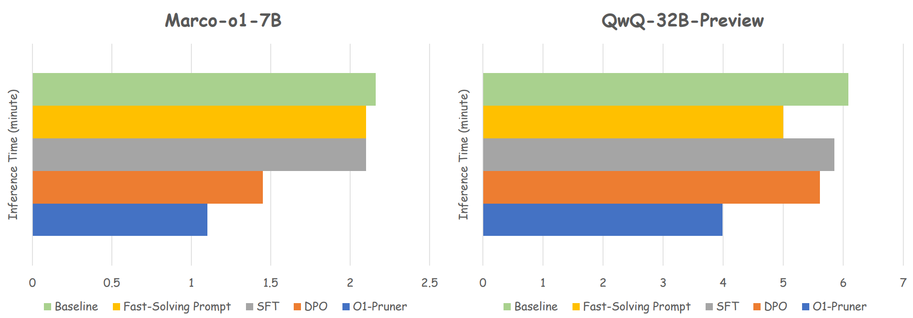

# O1-Pruner
Official repository for paper: O1-Pruner: Length-Harmonizing Fine-Tuning for O1-Like Reasoning Pruning.

O1-Pruner is a post-training technique that can accelerate the inference O1-like long thought reasoning models. Experiments show that the inference time overhead can be reduced by up to 50%. For more details, see our paper on arxiv: [O1-Pruner](https://arxiv.org/html/2501.12570v1)

## Pruned O1 Models
### Models
[Marco-o1-7B-Pruned](https://huggingface.co/LordNoah/Marco-o1-7B-Pruned)

[QwQ-32B-Preview-Pruned](https://huggingface.co/LordNoah/QwQ-32B-Preview-Pruned)

## Abstract
Recently, long-thought reasoning LLMs, such as OpenAI's O1, have adopted extended reasoning processes similar to how humans ponder over complex problems. This reasoning paradigm significantly enhances the model's problem-solving abilities and has achieved promising results. However, long-thought reasoning process leads to a substantial increase in inference time. A pressing challenge is reducing the inference overhead of long-thought LLMs while ensuring accuracy. 
In this paper, we experimentally demonstrate that long-thought reasoning models struggle to effectively allocate token budgets based on problem difficulty and reasoning redundancies. To address this, we propose Length-Harmonizing Fine-Tuning (**O1-Pruner**), aiming at minimizing reasoning overhead while maintaining accuracy. This effective fine-tuning method first estimates the LLM's baseline performance through pre-sampling and then uses RL-style fine-tuning to encourage the model to generate shorter reasoning processes under accuracy constraints. This allows the model to achieve efficient reasoning with lower redundancy while maintaining accuracy. Experiments on various mathematical reasoning benchmarks show that **O1-Pruner** not only significantly reduces inference overhead but also achieves higher accuracy, providing a novel and promising solution to this challenge.

## Time Cost of Different Methods
</img>

## Method Overview
</img>


## Usage
We use A800-80G GPUs for inference and training. For the 7B model, 4 GPUs are required; for the 32B model, 8 GPUs are required.
### Installation
Firstly you should create a venv using conda
```bash
conda create -n o1-pruner python==3.11.9
conda activate o1-pruner
```
Then clone and install our project
```bash
git clone https://github.com/StarDewXXX/O1-Pruner
cd O1-Pruner
pip install -e .
```
Our project uses llamafactory for training and vllm for generation. During our experiments, we encountered version conflict issues. To avoid potential conflicts, we recommend installing vllm in a separate environment.
```bash
conda create -n vllm python==3.11.9
conda activate vllm
pip install vllm==0.6.3
```
### Generate Your Training Data (Taking QwQ-32B-Preview as an example)
Parameter meanings:

**K**: The number of solutions generated for each problem. 

**alpha**: Accuracy penalty term. The higher the value, the more the model will focus on accuracy rather than the length of the output.

Generating samples is relatively time-consuming because the samples produced by O1 models are quite long. For efficiency reasons, you can reduce the value of K, but this will increase the calculation error of the reward, which may affect the final performance. *Note that **K** should be set to the same value during both the inference and dataset construction stages*
```bash
# By default we use 4 gpus for inference, you can change gpus count by setting --n_gpus in the command
# You can select differenct commands, for training data generation, use commands in the "Generate Training Data for O1-Pruner" area
bash o1_scripts/inference.sh
```

```bash
python o1_scripts/construct_dataset.py --file_name QwQ_math_train_8192_normal_K-12 --K 12 --model_name QwQ --model_path Qwen/QwQ-32B-Preview --alpha 5
```
### Prune Your Model
```bash
llamafactory-cli train examples/math/QwQ-32B.yaml
```

### Test Your Model
```bash
# You can select differenct commands, for testing models, use commands in the "Test Pruned Model or Orginal Model" area
bash o1_scripts/inference.sh 
```


